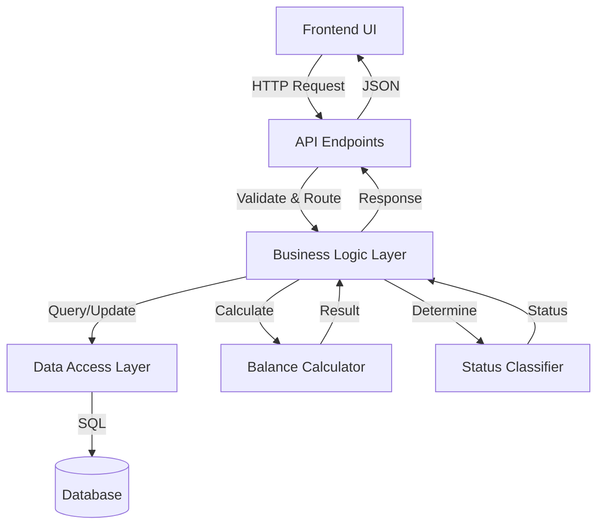
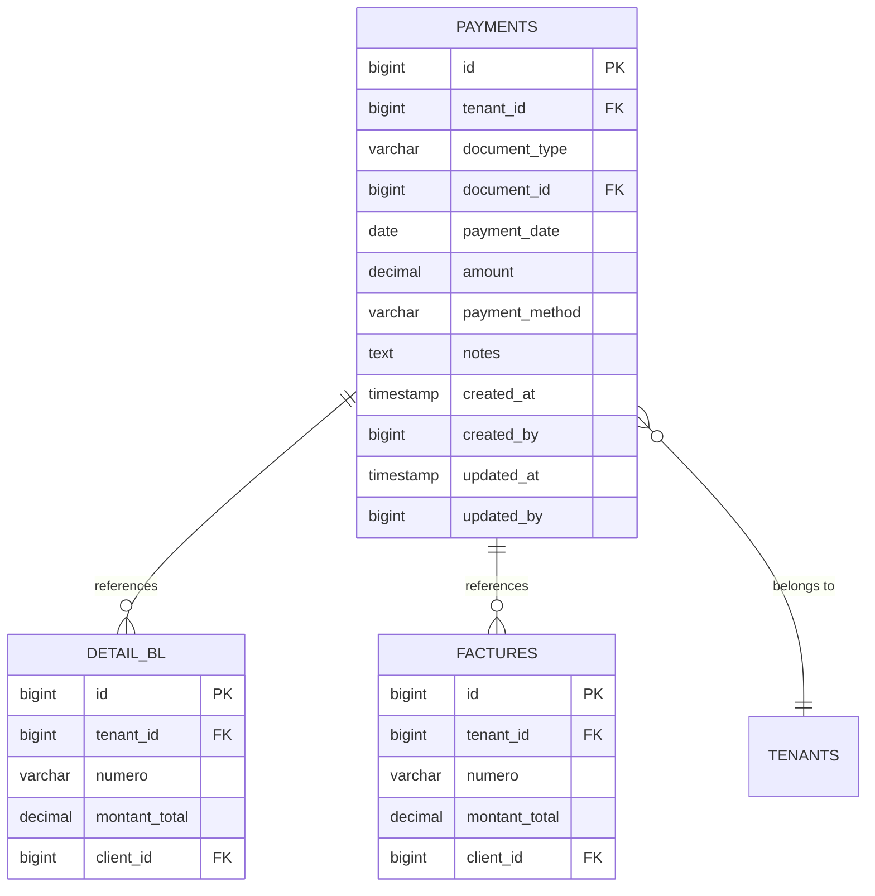
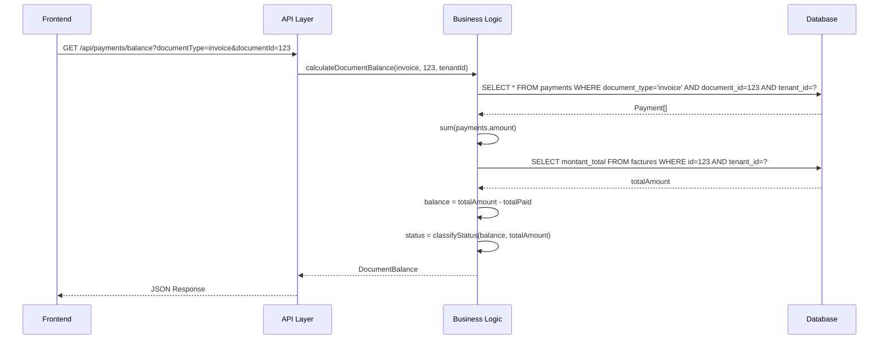

# Design Document: Client Payment Tracking System

## Overview

The Client Payment Tracking System is a full-stack feature that enables users to record, track, and manage partial payments for delivery notes and invoices in a multi-tenant stock management application. The system provides real-time balance calculations, payment history tracking, and a dashboard for monitoring outstanding balances across all documents.

### Key Design Goals

1. **Data Integrity**: Ensure accurate balance calculations and maintain referential integrity between payments and documents
2. **Multi-Tenant Isolation**: Strictly enforce tenant boundaries at all data access layers
3. **Performance**: Optimize queries for balance calculations and dashboard displays
4. **Extensibility**: Design the schema to support future payment types and features
5. **User Experience**: Provide intuitive interfaces for payment entry and status visualization

### Technology Stack

- **Frontend**: Next.js 14+ with TypeScript, React Server Components
- **Backend**: Node.js with Express.js
- **Database**: MySQL and PostgreSQL (dual support)
- **ORM/Query Builder**: To be determined based on existing codebase patterns
- **API**: RESTful endpoints with JSON payloads

## Architecture

### System Components

The payment tracking system consists of four primary layers:

1. **Data Layer**: Database schema, models, and data access logic
2. **Business Logic Layer**: Payment calculations, validation, and business rules
3. **API Layer**: RESTful endpoints for CRUD operations
4. **Presentation Layer**: React components for UI and user interactions

### Component Interaction Flow



### Multi-Tenant Architecture

All data access must enforce tenant isolation:

```typescript
// Every query must include tenant_id filter
WHERE tenant_id = :currentTenantId

// Payment creation inherits tenant_id from parent document
payment.tenant_id = document.tenant_id
```

## Components and Interfaces

### Database Schema

#### Payments Table

```sql
CREATE TABLE payments (
    id BIGINT PRIMARY KEY AUTO_INCREMENT,
    tenant_id BIGINT NOT NULL,
    document_type VARCHAR(20) NOT NULL, -- 'delivery_note' or 'invoice'
    document_id BIGINT NOT NULL,
    payment_date DATE NOT NULL,
    amount DECIMAL(15, 2) NOT NULL,
    payment_method VARCHAR(50),
    notes TEXT,
    created_at TIMESTAMP DEFAULT CURRENT_TIMESTAMP,
    created_by BIGINT,
    updated_at TIMESTAMP DEFAULT CURRENT_TIMESTAMP ON UPDATE CURRENT_TIMESTAMP,
    updated_by BIGINT,
    
    INDEX idx_tenant_document (tenant_id, document_type, document_id),
    INDEX idx_payment_date (payment_date),
    INDEX idx_tenant_id (tenant_id),
    
    CONSTRAINT chk_amount_positive CHECK (amount > 0),
    CONSTRAINT chk_document_type CHECK (document_type IN ('delivery_note', 'invoice'))
);
```

**Design Decisions**:
- `document_type` + `document_id`: Polymorphic relationship to support both delivery notes and invoices
- `DECIMAL(15, 2)`: Sufficient precision for monetary amounts up to 999,999,999,999.99
- Composite index on `(tenant_id, document_type, document_id)`: Optimizes the most common query pattern
- `payment_method` as VARCHAR: Flexible to support various payment types without enum constraints
- Audit fields (`created_by`, `updated_by`): Track who made changes for accountability

### Data Models

#### Payment Model

```typescript
interface Payment {
    id: number;
    tenantId: number;
    documentType: 'delivery_note' | 'invoice';
    documentId: number;
    paymentDate: Date;
    amount: number;
    paymentMethod?: string;
    notes?: string;
    createdAt: Date;
    createdBy?: number;
    updatedAt: Date;
    updatedBy?: number;
}
```

#### Payment Summary Model

```typescript
interface PaymentSummary {
    documentType: 'delivery_note' | 'invoice';
    documentId: number;
    documentNumber: string;
    clientName: string;
    totalAmount: number;
    totalPaid: number;
    balance: number;
    paymentStatus: 'paid' | 'partially_paid' | 'unpaid' | 'overpaid';
    paymentCount: number;
    lastPaymentDate?: Date;
}
```

#### Document Balance Model

```typescript
interface DocumentBalance {
    totalAmount: number;
    totalPaid: number;
    balance: number;
    status: 'paid' | 'partially_paid' | 'unpaid' | 'overpaid';
}
```

### API Endpoints

#### Payment CRUD Operations

**Create Payment**
```
POST /api/payments
Content-Type: application/json

Request Body:
{
    "documentType": "delivery_note" | "invoice",
    "documentId": number,
    "paymentDate": "YYYY-MM-DD",
    "amount": number,
    "paymentMethod": string (optional),
    "notes": string (optional)
}

Response: 201 Created
{
    "success": true,
    "data": Payment
}
```

**Get Payments for Document**
```
GET /api/payments?documentType={type}&documentId={id}

Response: 200 OK
{
    "success": true,
    "data": Payment[]
}
```

**Get Single Payment**
```
GET /api/payments/:id

Response: 200 OK
{
    "success": true,
    "data": Payment
}
```

**Update Payment**
```
PUT /api/payments/:id
Content-Type: application/json

Request Body:
{
    "paymentDate": "YYYY-MM-DD" (optional),
    "amount": number (optional),
    "paymentMethod": string (optional),
    "notes": string (optional)
}

Response: 200 OK
{
    "success": true,
    "data": Payment
}
```

**Delete Payment**
```
DELETE /api/payments/:id

Response: 200 OK
{
    "success": true,
    "message": "Payment deleted successfully"
}
```

**Get Document Balance**
```
GET /api/payments/balance?documentType={type}&documentId={id}

Response: 200 OK
{
    "success": true,
    "data": DocumentBalance
}
```

**Get Outstanding Balances Dashboard**
```
GET /api/payments/outstanding?documentType={type}&clientId={id}&sortBy={field}&sortOrder={asc|desc}

Response: 200 OK
{
    "success": true,
    "data": PaymentSummary[]
}
```

### Business Logic Components

#### Balance Calculator

```typescript
class BalanceCalculator {
    /**
     * Calculate the remaining balance for a document
     * @param documentTotalAmount - The total amount due on the document
     * @param payments - Array of payments made against the document
     * @returns The remaining balance (positive = owed, negative = overpaid, zero = paid)
     */
    calculateBalance(documentTotalAmount: number, payments: Payment[]): number {
        const totalPaid = payments.reduce((sum, payment) => sum + payment.amount, 0);
        return documentTotalAmount - totalPaid;
    }
    
    /**
     * Calculate total amount paid from payments
     */
    calculateTotalPaid(payments: Payment[]): number {
        return payments.reduce((sum, payment) => sum + payment.amount, 0);
    }
}
```

#### Payment Status Classifier

```typescript
class PaymentStatusClassifier {
    /**
     * Determine the payment status based on balance
     * @param balance - The remaining balance (from BalanceCalculator)
     * @param totalAmount - The total amount due
     * @returns Payment status classification
     */
    classifyStatus(balance: number, totalAmount: number): PaymentStatus {
        if (balance === totalAmount) {
            return 'unpaid';
        } else if (balance === 0) {
            return 'paid';
        } else if (balance < 0) {
            return 'overpaid';
        } else {
            return 'partially_paid';
        }
    }
}
```

#### Payment Validator

```typescript
class PaymentValidator {
    /**
     * Validate payment data before creation or update
     */
    validatePayment(payment: Partial<Payment>): ValidationResult {
        const errors: string[] = [];
        
        // Amount must be positive
        if (payment.amount !== undefined && payment.amount <= 0) {
            errors.push('Payment amount must be greater than zero');
        }
        
        // Payment date cannot be in the future
        if (payment.paymentDate) {
            const today = new Date();
            today.setHours(0, 0, 0, 0);
            const paymentDate = new Date(payment.paymentDate);
            paymentDate.setHours(0, 0, 0, 0);
            
            if (paymentDate > today) {
                errors.push('Payment date cannot be in the future');
            }
        }
        
        return {
            isValid: errors.length === 0,
            errors
        };
    }
}
```

### Data Access Layer

#### Payment Repository

```typescript
interface PaymentRepository {
    /**
     * Create a new payment
     */
    create(payment: Omit<Payment, 'id' | 'createdAt' | 'updatedAt'>, userId: number): Promise<Payment>;
    
    /**
     * Find payment by ID with tenant isolation
     */
    findById(id: number, tenantId: number): Promise<Payment | null>;
    
    /**
     * Find all payments for a document with tenant isolation
     */
    findByDocument(documentType: string, documentId: number, tenantId: number): Promise<Payment[]>;
    
    /**
     * Update an existing payment
     */
    update(id: number, updates: Partial<Payment>, userId: number, tenantId: number): Promise<Payment>;
    
    /**
     * Delete a payment
     */
    delete(id: number, tenantId: number): Promise<void>;
    
    /**
     * Get outstanding balances for dashboard
     */
    getOutstandingBalances(
        tenantId: number,
        filters?: {
            documentType?: string;
            clientId?: number;
        },
        sorting?: {
            sortBy: string;
            sortOrder: 'asc' | 'desc';
        }
    ): Promise<PaymentSummary[]>;
}
```

### Frontend Components

#### Payment Entry Form Component

```typescript
interface PaymentFormProps {
    documentType: 'delivery_note' | 'invoice';
    documentId: number;
    documentTotalAmount: number;
    onSuccess: () => void;
    onCancel: () => void;
}

// Component allows users to enter payment details
// Validates input before submission
// Shows current balance and updates after payment
```

#### Payment History Component

```typescript
interface PaymentHistoryProps {
    documentType: 'delivery_note' | 'invoice';
    documentId: number;
}

// Displays table of all payments for a document
// Shows: date, amount, payment method, notes
// Allows editing and deleting payments
// Updates balance in real-time
```

#### Payment Summary Widget

```typescript
interface PaymentSummaryProps {
    documentType: 'delivery_note' | 'invoice';
    documentId: number;
    totalAmount: number;
}

// Compact display for document detail pages
// Shows: total amount, total paid, balance, status
// Color-coded status indicator
// Link to full payment history
```

#### Outstanding Balances Dashboard

```typescript
interface OutstandingDashboardProps {
    // No props - fetches data based on current tenant
}

// Table view of all documents with outstanding balances
// Columns: document number, client, total, paid, balance, status
// Filters: document type, client
// Sorting: balance, date, client name
// Click row to view document details
```

## Data Models

### Payment Entity Relationships



### Balance Calculation Flow




## Correctness Properties

*A property is a characteristic or behavior that should hold true across all valid executions of a system—essentially, a formal statement about what the system should do. Properties serve as the bridge between human-readable specifications and machine-verifiable correctness guarantees.*

### Property 1: Payment Data Persistence

*For any* valid payment with all required fields (document type, document ID, payment date, amount), when the payment is created, retrieving it by ID should return a payment with all the same field values including audit fields (created_at, created_by).

**Validates: Requirements 1.1, 1.6**

### Property 2: Payment Document Association

*For any* created payment, it should be associated with exactly one document (either a delivery note or an invoice), and the association should be retrievable.

**Validates: Requirements 1.2**

### Property 3: Payment Amount Validation

*For any* payment creation or update attempt with an amount less than or equal to zero, the system should reject the operation and return a validation error.

**Validates: Requirements 1.3, 5.2**

### Property 4: Payment Date Validation

*For any* payment creation or update attempt with a payment date in the future, the system should reject the operation and return a validation error.

**Validates: Requirements 1.4, 5.3**

### Property 5: Tenant ID Inheritance

*For any* payment created for a document, the payment's tenant_id should equal the document's tenant_id.

**Validates: Requirements 1.5, 8.1**

### Property 6: Balance Calculation Correctness

*For any* document with a total amount and a set of payments, the calculated balance should equal the document's total amount minus the sum of all payment amounts.

**Validates: Requirements 2.1, 2.2**

### Property 7: Status Classification Correctness

*For any* document with a calculated balance and total amount, the payment status should be:
- "unpaid" when balance equals total amount
- "paid" when balance equals zero
- "partially_paid" when balance is between zero and total amount (exclusive)
- "overpaid" when balance is negative

**Validates: Requirements 3.1, 3.2, 3.3, 3.4**

### Property 8: Payment History Completeness

*For any* document, retrieving its payment history should return all payments associated with that document, with each payment containing all required fields (date, amount, payment method, notes), ordered by payment date in descending order.

**Validates: Requirements 4.1, 4.2, 4.3**

### Property 9: Tenant Isolation in Queries

*For any* payment query operation (retrieve by ID, retrieve by document, retrieve history), the results should only include payments where tenant_id matches the current user's tenant_id, and should never include payments from other tenants.

**Validates: Requirements 4.5, 8.2, 8.3, 8.4**

### Property 10: Payment Update Persistence

*For any* existing payment and valid update data (payment date, amount, payment method, notes), after updating the payment, retrieving it should return the updated values along with updated audit fields (updated_at, updated_by).

**Validates: Requirements 5.1, 5.6**

### Property 11: Payment Deletion Completeness

*For any* existing payment, after deleting it, attempting to retrieve it by ID should return null or not found, and it should not appear in the document's payment history.

**Validates: Requirements 5.4**

### Property 12: Cross-Tenant Modification Prevention

*For any* payment belonging to tenant A, when a user from tenant B attempts to update or delete it, the operation should be denied and return an authorization error.

**Validates: Requirements 5.5, 8.5**

### Property 13: Outstanding Balance Filtering

*For any* outstanding balance dashboard query, all returned documents should have a balance greater than zero, and no documents with zero or negative balance should be included.

**Validates: Requirements 6.1**

### Property 14: Dashboard Data Completeness

*For any* document in the outstanding balance dashboard, the returned data should include document number, client name, total amount, amount paid, remaining balance, and payment status.

**Validates: Requirements 6.2, 6.3**

### Property 15: Dashboard Filtering Correctness

*For any* outstanding balance dashboard query with filters (document type or client ID), all returned documents should match the specified filter criteria, and no documents that don't match should be included.

**Validates: Requirements 6.4, 6.5**

### Property 16: Dashboard Sorting Correctness

*For any* outstanding balance dashboard query with a sort parameter (balance, date, or client name) and sort order (ascending or descending), the returned documents should be ordered according to the specified field and direction.

**Validates: Requirements 6.6**

### Property 17: Payment Summary Completeness

*For any* document, the payment summary should include total amount due, total amount paid, remaining balance, payment status, and payment count, with all calculations matching the results from the balance calculator and status classifier.

**Validates: Requirements 7.1, 7.2, 7.3, 7.4, 7.5**

### Property 18: API Authentication Enforcement

*For any* API endpoint call without valid authentication credentials, the system should return a 401 Unauthorized status code and deny access to the requested resource.

**Validates: Requirements 9.7**

### Property 19: API Error Response Format

*For any* API endpoint call that results in an error (validation error, not found, unauthorized, etc.), the system should return an appropriate HTTP status code (400, 401, 404, 500) and a JSON response with error details.

**Validates: Requirements 9.8**

### Property 20: Database Constraint Enforcement

*For any* attempt to insert a payment with null values in required fields (tenant_id, document_type, document_id, payment_date, amount), the database should reject the operation with a constraint violation error.

**Validates: Requirements 10.6**

### Property 21: Foreign Key Constraint Enforcement

*For any* attempt to insert a payment with an invalid tenant_id (one that doesn't exist in the tenants table), the database should reject the operation with a foreign key constraint violation.

**Validates: Requirements 10.2**

## Error Handling

### Validation Errors

**Payment Amount Validation**
- Error: Amount <= 0
- Response: 400 Bad Request
- Message: "Payment amount must be greater than zero"

**Payment Date Validation**
- Error: Payment date in the future
- Response: 400 Bad Request
- Message: "Payment date cannot be in the future"

**Required Field Validation**
- Error: Missing required fields (documentType, documentId, paymentDate, amount)
- Response: 400 Bad Request
- Message: "Missing required field: {fieldName}"

### Authorization Errors

**Tenant Isolation Violation**
- Error: Attempting to access payment from different tenant
- Response: 403 Forbidden
- Message: "Access denied: insufficient permissions"

**Authentication Failure**
- Error: Missing or invalid authentication token
- Response: 401 Unauthorized
- Message: "Authentication required"

### Not Found Errors

**Payment Not Found**
- Error: Payment ID doesn't exist or belongs to different tenant
- Response: 404 Not Found
- Message: "Payment not found"

**Document Not Found**
- Error: Referenced document doesn't exist
- Response: 404 Not Found
- Message: "Document not found"

### Database Errors

**Constraint Violation**
- Error: Foreign key constraint, NOT NULL constraint, CHECK constraint
- Response: 400 Bad Request
- Message: "Invalid data: {constraint details}"

**Connection Error**
- Error: Database connection failure
- Response: 503 Service Unavailable
- Message: "Service temporarily unavailable"

### Error Response Format

All API errors follow a consistent JSON format:

```json
{
    "success": false,
    "error": {
        "code": "VALIDATION_ERROR",
        "message": "Payment amount must be greater than zero",
        "details": {
            "field": "amount",
            "value": -10,
            "constraint": "must be greater than zero"
        }
    }
}
```

## Testing Strategy

### Dual Testing Approach

The payment tracking system requires both unit testing and property-based testing for comprehensive coverage:

**Unit Tests**: Focus on specific examples, edge cases, and integration points
- Specific payment scenarios (e.g., first payment, final payment, overpayment)
- Edge cases (empty payment history, zero balance, negative balance)
- Error conditions (invalid tenant access, missing fields, constraint violations)
- API endpoint integration (request/response format, status codes)
- Database schema validation (table structure, indexes, constraints)

**Property-Based Tests**: Verify universal properties across all inputs
- Generate random payments with varying amounts, dates, and methods
- Generate random document totals and payment combinations
- Test balance calculations with randomized payment sets
- Test status classification with randomized balance scenarios
- Test tenant isolation with randomized tenant IDs
- Minimum 100 iterations per property test to ensure comprehensive coverage

### Property-Based Testing Configuration

**Testing Library**: Use `fast-check` for TypeScript/JavaScript property-based testing

**Test Configuration**:
```typescript
import fc from 'fast-check';

// Each property test should run minimum 100 iterations
fc.assert(
    fc.property(/* generators */, (/* inputs */) => {
        // property assertion
    }),
    { numRuns: 100 }
);
```

**Test Tagging**: Each property test must reference its design document property

```typescript
describe('Feature: client-payment-tracking, Property 6: Balance Calculation Correctness', () => {
    it('should calculate balance as total minus sum of payments', () => {
        fc.assert(
            fc.property(
                fc.float({ min: 0.01, max: 1000000 }), // document total
                fc.array(fc.float({ min: 0.01, max: 10000 })), // payment amounts
                (totalAmount, paymentAmounts) => {
                    const payments = paymentAmounts.map(amount => ({ amount }));
                    const balance = calculateBalance(totalAmount, payments);
                    const expectedBalance = totalAmount - paymentAmounts.reduce((sum, amt) => sum + amt, 0);
                    expect(balance).toBeCloseTo(expectedBalance, 2);
                }
            ),
            { numRuns: 100 }
        );
    });
});
```

### Test Coverage Requirements

**Unit Test Coverage**:
- All API endpoints (create, read, update, delete)
- All validation functions
- Balance calculator with specific scenarios
- Status classifier with boundary conditions
- Database migrations and schema
- Error handling for all error types

**Property Test Coverage**:
- Each of the 21 correctness properties must have a corresponding property-based test
- Each test must be tagged with: `Feature: client-payment-tracking, Property {N}: {property title}`
- Tests should use randomized inputs to cover wide range of scenarios
- Focus on invariants, calculations, and security boundaries

### Integration Testing

**Database Integration**:
- Test with both MySQL and PostgreSQL
- Verify constraint enforcement
- Test transaction rollback on errors
- Verify index usage for performance

**API Integration**:
- Test full request/response cycle
- Verify authentication middleware
- Test tenant isolation at API layer
- Verify error response formats

**Frontend Integration**:
- Test payment form submission
- Test payment history display
- Test dashboard filtering and sorting
- Test real-time balance updates

### Testing Best Practices

1. **Avoid excessive unit tests**: Property-based tests handle comprehensive input coverage, so unit tests should focus on specific examples and edge cases, not exhaustive input combinations

2. **Test one property per test**: Each property-based test should verify a single correctness property from the design document

3. **Use realistic generators**: Generate payment amounts, dates, and other values that reflect real-world usage patterns

4. **Test tenant isolation thoroughly**: Security is critical, so every data access path should have property tests verifying tenant boundaries

5. **Test balance calculations extensively**: Financial calculations must be precise, so use property tests to verify correctness across all payment combinations

6. **Mock external dependencies**: Database and API calls should be mocked in unit tests, but integration tests should use real connections

7. **Test error paths**: Both unit and property tests should verify error handling for invalid inputs and constraint violations
