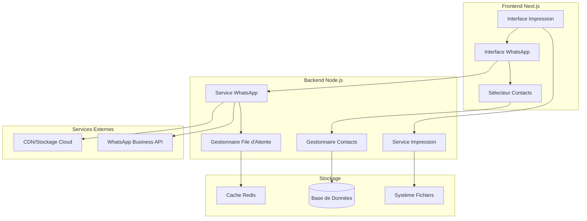
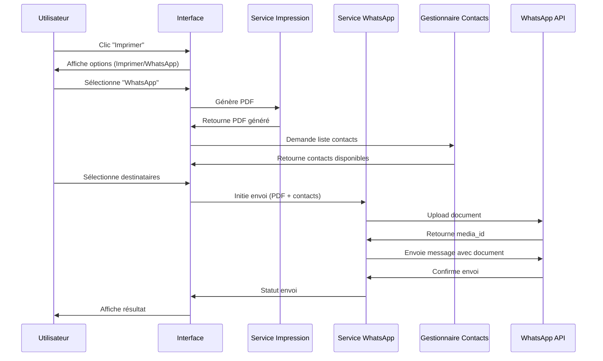

# Document de Conception

## Vue d'Ensemble

Cette fonctionnalité étend le système d'impression existant pour permettre l'envoi direct de documents PDF via WhatsApp Business API. L'architecture s'intègre naturellement dans le workflow d'impression actuel en ajoutant une option d'envoi WhatsApp parallèle à l'impression traditionnelle.

L'implémentation utilise le SDK officiel WhatsApp Business Node.js et respecte l'architecture multi-tenant existante. La solution gère les documents jusqu'à 16MB (limite WhatsApp) avec des mécanismes de fallback pour les fichiers plus volumineux.

## Architecture

### Architecture Globale



### Flux de Données Principal



## Composants et Interfaces

### 1. Extension du Service d'Impression

**PrintService** (existant, à étendre)
```typescript
interface PrintService {
  // Méthodes existantes...
  
  // Nouvelles méthodes
  generatePDFForWhatsApp(documentId: string, tenantId: string): Promise<PDFBuffer>
  getDocumentMetadata(documentId: string): Promise<DocumentMetadata>
}

interface DocumentMetadata {
  id: string
  type: 'invoice' | 'delivery_note' | 'proforma'
  filename: string
  size: number
  clientId?: string
  createdAt: Date
}
```

### 2. Service WhatsApp

**WhatsAppService** (nouveau)
```typescript
interface WhatsAppService {
  sendDocument(request: SendDocumentRequest): Promise<SendDocumentResponse>
  validatePhoneNumber(phoneNumber: string): Promise<ValidationResult>
  getDeliveryStatus(messageId: string): Promise<DeliveryStatus>
  uploadMedia(buffer: Buffer, filename: string): Promise<MediaUploadResult>
}

interface SendDocumentRequest {
  tenantId: string
  document: PDFBuffer
  recipients: WhatsAppContact[]
  customMessage?: string
  documentMetadata: DocumentMetadata
}

interface WhatsAppContact {
  phoneNumber: string
  name?: string
  clientId?: string
}

interface SendDocumentResponse {
  success: boolean
  results: ContactSendResult[]
  queuedCount: number
  failedCount: number
}

interface ContactSendResult {
  contact: WhatsAppContact
  success: boolean
  messageId?: string
  error?: string
  status: 'sent' | 'queued' | 'failed'
}
```

### 3. Gestionnaire de Contacts

**ContactManager** (nouveau)
```typescript
interface ContactManager {
  getWhatsAppContacts(tenantId: string, clientId?: string): Promise<WhatsAppContact[]>
  validateAndFormatNumber(phoneNumber: string): Promise<string>
  saveWhatsAppNumber(clientId: string, phoneNumber: string, tenantId: string): Promise<void>
  searchContacts(tenantId: string, query: string): Promise<WhatsAppContact[]>
}
```

### 4. Gestionnaire de File d'Attente

**QueueManager** (nouveau)
```typescript
interface QueueManager {
  enqueueWhatsAppSend(request: SendDocumentRequest): Promise<string>
  processQueue(): Promise<void>
  getQueueStatus(jobId: string): Promise<QueueJobStatus>
  retryFailedJobs(): Promise<void>
}

interface QueueJobStatus {
  id: string
  status: 'pending' | 'processing' | 'completed' | 'failed'
  attempts: number
  lastError?: string
  createdAt: Date
  processedAt?: Date
}
```

## Modèles de Données

### 1. Configuration WhatsApp par Tenant

```sql
CREATE TABLE whatsapp_configs (
  id UUID PRIMARY KEY DEFAULT gen_random_uuid(),
  tenant_id UUID NOT NULL REFERENCES tenants(id),
  business_account_id VARCHAR(255) NOT NULL,
  phone_number_id VARCHAR(255) NOT NULL,
  access_token_encrypted TEXT NOT NULL,
  webhook_verify_token_encrypted TEXT NOT NULL,
  is_active BOOLEAN DEFAULT true,
  daily_message_limit INTEGER DEFAULT 1000,
  created_at TIMESTAMP DEFAULT NOW(),
  updated_at TIMESTAMP DEFAULT NOW(),
  
  UNIQUE(tenant_id)
);
```

### 2. Historique des Envois WhatsApp

```sql
CREATE TABLE whatsapp_sends (
  id UUID PRIMARY KEY DEFAULT gen_random_uuid(),
  tenant_id UUID NOT NULL REFERENCES tenants(id),
  document_id UUID NOT NULL,
  document_type VARCHAR(50) NOT NULL,
  recipient_phone VARCHAR(20) NOT NULL,
  recipient_name VARCHAR(255),
  client_id UUID REFERENCES clients(id),
  message_id VARCHAR(255), -- ID du message WhatsApp
  custom_message TEXT,
  status VARCHAR(20) DEFAULT 'pending', -- pending, sent, delivered, read, failed
  error_message TEXT,
  file_size INTEGER,
  attempts INTEGER DEFAULT 0,
  sent_at TIMESTAMP,
  delivered_at TIMESTAMP,
  read_at TIMESTAMP,
  created_at TIMESTAMP DEFAULT NOW(),
  updated_at TIMESTAMP DEFAULT NOW(),
  
  INDEX idx_tenant_document (tenant_id, document_id),
  INDEX idx_status_created (status, created_at),
  INDEX idx_message_id (message_id)
);
```

### 3. Contacts WhatsApp

```sql
CREATE TABLE whatsapp_contacts (
  id UUID PRIMARY KEY DEFAULT gen_random_uuid(),
  tenant_id UUID NOT NULL REFERENCES tenants(id),
  client_id UUID REFERENCES clients(id),
  phone_number VARCHAR(20) NOT NULL,
  name VARCHAR(255),
  is_verified BOOLEAN DEFAULT false,
  last_verified_at TIMESTAMP,
  created_at TIMESTAMP DEFAULT NOW(),
  updated_at TIMESTAMP DEFAULT NOW(),
  
  UNIQUE(tenant_id, client_id, phone_number),
  INDEX idx_tenant_phone (tenant_id, phone_number)
);
```

### 4. File d'Attente WhatsApp

```sql
CREATE TABLE whatsapp_queue (
  id UUID PRIMARY KEY DEFAULT gen_random_uuid(),
  tenant_id UUID NOT NULL REFERENCES tenants(id),
  job_data JSONB NOT NULL,
  status VARCHAR(20) DEFAULT 'pending',
  attempts INTEGER DEFAULT 0,
  max_attempts INTEGER DEFAULT 3,
  scheduled_at TIMESTAMP DEFAULT NOW(),
  processed_at TIMESTAMP,
  error_message TEXT,
  created_at TIMESTAMP DEFAULT NOW(),
  
  INDEX idx_status_scheduled (status, scheduled_at),
  INDEX idx_tenant_status (tenant_id, status)
);
```

## Correctness Properties

*Une propriété est une caractéristique ou un comportement qui doit être vrai pour toutes les exécutions valides d'un système - essentiellement, une déclaration formelle sur ce que le système devrait faire. Les propriétés servent de pont entre les spécifications lisibles par l'homme et les garanties de correction vérifiables par machine.*

Avant d'écrire les propriétés de correction, analysons les critères d'acceptation pour déterminer leur testabilité :

Basé sur l'analyse de testabilité ci-dessus, voici les propriétés de correction consolidées :

### Propriété 1: Disponibilité de l'Option WhatsApp
*Pour tous* les types de documents supportés (factures, bons de livraison, proformas), l'interface d'impression doit proposer l'option "Envoyer via WhatsApp"
**Valide: Exigences 1.1, 1.4**

### Propriété 2: Génération et Ouverture d'Interface
*Pour tout* document sélectionné pour envoi WhatsApp, le système doit générer le PDF et ouvrir l'interface de sélection des contacts
**Valide: Exigences 1.2**

### Propriété 3: Validation des Numéros WhatsApp
*Pour tout* numéro de téléphone saisi ou sélectionné, le système doit valider le format WhatsApp international et vérifier l'activité sur WhatsApp
**Valide: Exigences 2.2, 2.5, 6.2**

### Propriété 4: Envoi Groupé
*Pour tous* les contacts sélectionnés dans une session d'envoi, le document doit être envoyé à chaque destinataire via l'API WhatsApp Business
**Valide: Exigences 2.3, 3.1, 3.2**

### Propriété 5: Gestion des Limites de Taille
*Pour tout* document à envoyer, si la taille dépasse 16MB, le système doit proposer des alternatives (compression ou lien de téléchargement)
**Valide: Exigences 3.5, 6.3**

### Propriété 6: Mécanisme de Retry
*Pour tout* envoi échoué, le système doit retenter jusqu'à 3 fois avec délai exponentiel, puis proposer des alternatives si l'échec persiste
**Valide: Exigences 3.3, 6.4**

### Propriété 7: Traçabilité des Envois
*Pour tout* envoi WhatsApp effectué, le système doit enregistrer l'action dans l'historique avec identifiant de message, utilisateur, tenant et métadonnées
**Valide: Exigences 1.3, 3.4, 8.1**

### Propriété 8: Isolation Multi-Tenant
*Pour tout* utilisateur et document, le système doit vérifier l'appartenance au même tenant et maintenir l'isolation des configurations et données
**Valide: Exigences 5.1, 5.2, 5.3, 5.5**

### Propriété 9: Gestion de File d'Attente
*Pour tout* envoi lorsque l'API WhatsApp est indisponible, le système doit mettre l'envoi en file d'attente pour traitement ultérieur
**Valide: Exigences 6.1**

### Propriété 10: Messages Personnalisés et Templates
*Pour tout* envoi avec message personnalisé ou template, le système doit correctement substituer les variables dynamiques (nom client, numéro document)
**Valide: Exigences 4.2, 7.3**

### Propriété 11: Respect des Quotas
*Pour tout* tenant, le système doit respecter les limites d'envoi configurées et bloquer les envois dépassant les quotas
**Valide: Exigences 7.4**

### Propriété 12: Audit et Logging Complet
*Pour toute* action (envoi, erreur, modification de configuration), le système doit maintenir un log d'audit avec détails pour conformité
**Valide: Exigences 5.4, 6.5, 7.5**

### Propriété 13: Mise à Jour des Statuts
*Pour tout* message envoyé, lorsque des informations de statut (livré, lu) sont reçues de WhatsApp, le système doit mettre à jour l'historique
**Valide: Exigences 8.3**

### Propriété 14: Recherche et Filtrage d'Historique
*Pour toute* recherche dans l'historique des envois, le système doit permettre le filtrage par date, destinataire et statut avec résultats corrects
**Valide: Exigences 8.2, 8.4**

### Propriété 15: Rétention des Données
*Pour tous* les envois et métadonnées, le système doit conserver les informations pendant au moins 12 mois selon la politique de conformité
**Valide: Exigences 8.5**

## Gestion des Erreurs

### Stratégie de Gestion d'Erreurs

1. **Erreurs de Validation**
   - Numéros WhatsApp invalides
   - Documents trop volumineux
   - Permissions insuffisantes
   - Action : Affichage immédiat avec options de correction

2. **Erreurs d'API WhatsApp**
   - Limite de débit dépassée (rate limiting)
   - Credentials invalides
   - Numéro non actif sur WhatsApp
   - Action : Retry automatique puis notification utilisateur

3. **Erreurs de Réseau**
   - API WhatsApp indisponible
   - Timeout de connexion
   - Action : Mise en file d'attente avec retry différé

4. **Erreurs Système**
   - Échec de génération PDF
   - Erreur base de données
   - Espace disque insuffisant
   - Action : Logging détaillé et notification administrateur

### Codes d'Erreur Standardisés

```typescript
enum WhatsAppErrorCode {
  // Validation
  INVALID_PHONE_NUMBER = 'WA_001',
  FILE_TOO_LARGE = 'WA_002',
  UNSUPPORTED_FILE_TYPE = 'WA_003',
  INSUFFICIENT_PERMISSIONS = 'WA_004',
  
  // API WhatsApp
  RATE_LIMIT_EXCEEDED = 'WA_101',
  INVALID_CREDENTIALS = 'WA_102',
  PHONE_NOT_ON_WHATSAPP = 'WA_103',
  MESSAGE_TEMPLATE_REJECTED = 'WA_104',
  
  // Réseau
  API_UNAVAILABLE = 'WA_201',
  CONNECTION_TIMEOUT = 'WA_202',
  NETWORK_ERROR = 'WA_203',
  
  // Système
  PDF_GENERATION_FAILED = 'WA_301',
  DATABASE_ERROR = 'WA_302',
  STORAGE_ERROR = 'WA_303',
  QUEUE_FULL = 'WA_304'
}
```

## Stratégie de Test

### Approche de Test Dual

Cette fonctionnalité nécessite une approche de test combinant tests unitaires et tests basés sur les propriétés :

**Tests Unitaires** :
- Exemples spécifiques et cas limites
- Points d'intégration entre composants  
- Conditions d'erreur et cas exceptionnels
- Validation des interfaces utilisateur

**Tests Basés sur les Propriétés** :
- Propriétés universelles sur tous les inputs
- Couverture complète des inputs via randomisation
- Validation des invariants système
- Tests de robustesse avec données aléatoires

### Configuration des Tests Basés sur les Propriétés

**Bibliothèque recommandée** : `fast-check` pour Node.js/TypeScript
**Configuration minimale** : 100 itérations par test de propriété
**Format de tag** : `Feature: whatsapp-document-sharing, Property {number}: {property_text}`

Chaque propriété de correction doit être implémentée par UN SEUL test basé sur les propriétés. Les tests unitaires complètent en couvrant les exemples spécifiques et cas limites non couverts par les propriétés.

### Exemples de Tests

**Test de Propriété - Validation des Numéros** :
```typescript
// Feature: whatsapp-document-sharing, Property 3: Validation des Numéros WhatsApp
it('should validate all phone number formats correctly', () => {
  fc.assert(fc.property(
    fc.string(), // Numéro de téléphone aléatoire
    (phoneNumber) => {
      const result = validateWhatsAppNumber(phoneNumber);
      // Si valide, doit être au format international
      if (result.isValid) {
        expect(result.formattedNumber).toMatch(/^\+\d{10,15}$/);
      }
      // Doit toujours retourner un résultat de validation
      expect(result).toHaveProperty('isValid');
      expect(result).toHaveProperty('error');
    }
  ), { numRuns: 100 });
});
```

**Test Unitaire - Cas Spécifique** :
```typescript
it('should handle French mobile numbers correctly', () => {
  const result = validateWhatsAppNumber('06 12 34 56 78');
  expect(result.isValid).toBe(true);
  expect(result.formattedNumber).toBe('+33612345678');
});
```

Cette stratégie assure une couverture complète : les tests de propriétés vérifient la correction générale tandis que les tests unitaires valident des comportements spécifiques et des cas limites importants.